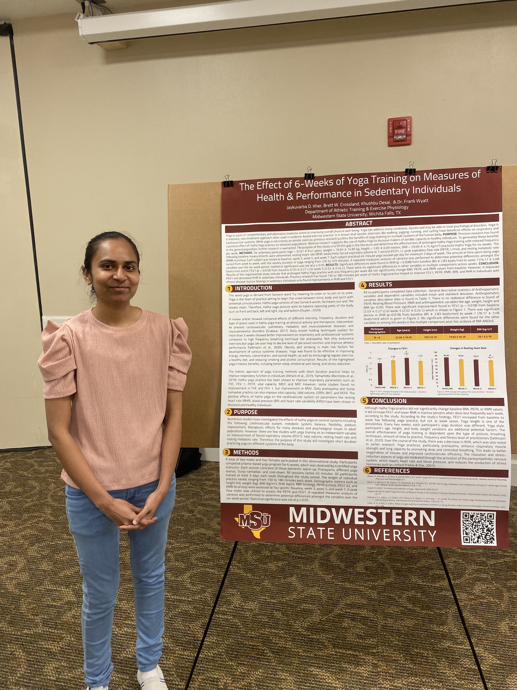
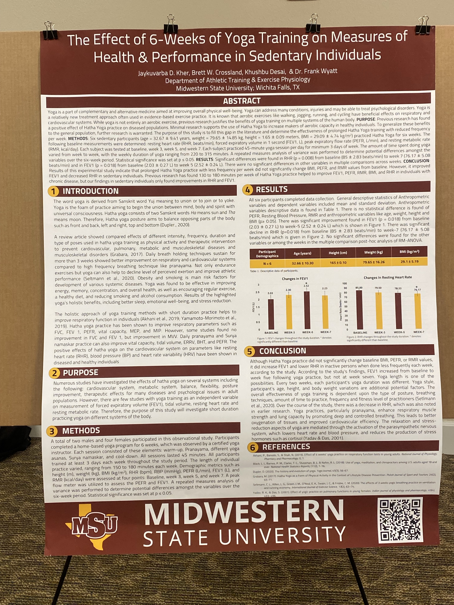

# Why I Liked the Presentation

I liked the presentation because it focused on a topic that’s both practical and relevant—yoga and its impact on health. The presenter explained the research clearly and highlighted how even a short, 6-week yoga program can influence key health markers like heart rate and respiratory function in sedentary individuals. The poster was well-organized, visually clean, and backed by data, making it easy to follow the purpose, methods, and results. It was especially interesting to see real-life applications of wellness practices supported by scientific evidence, which made the study both informative and engaging.

# Presentation Photos

  
*Figure 1: Student presenter with research poster*

  
*Figure 2: Close-up of the full poster presentation*
